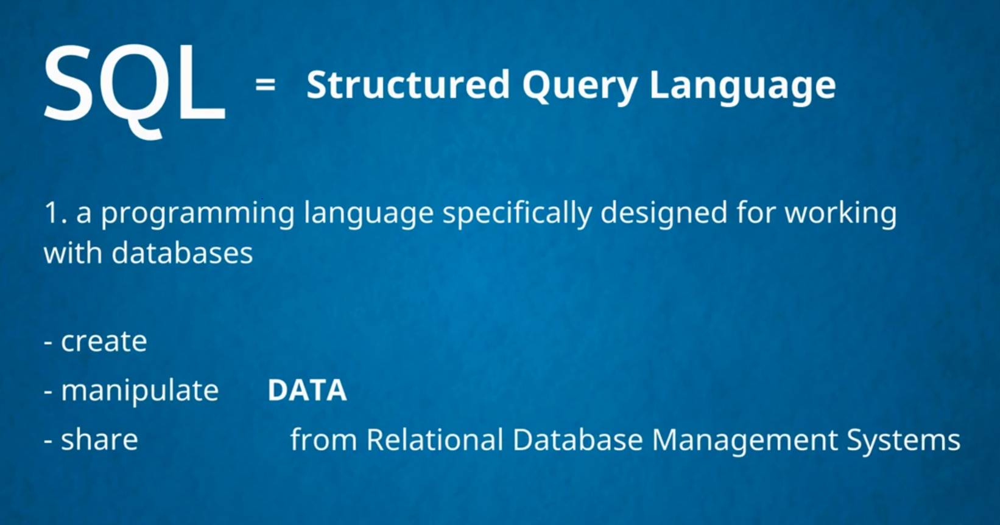
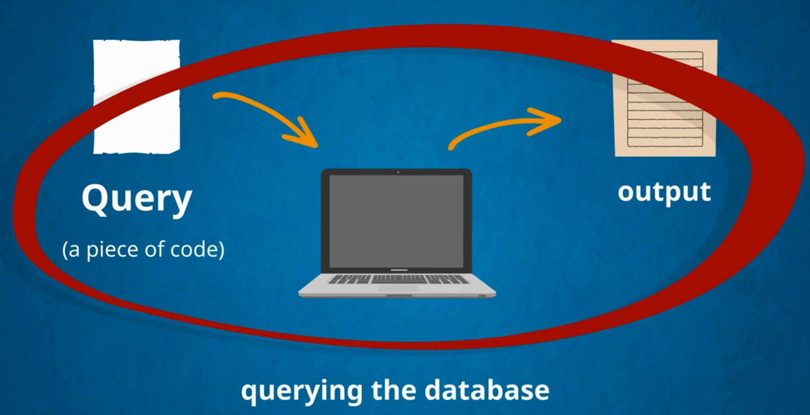
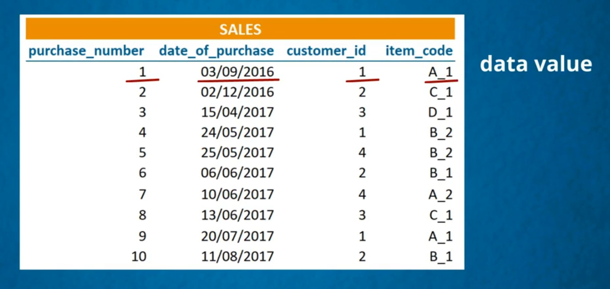
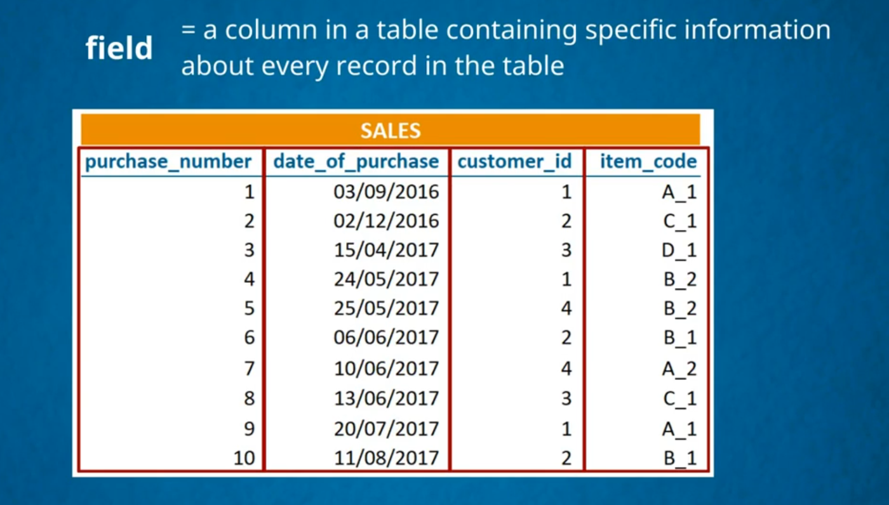

#  **MySql**

<!-- ~~this is not important~~ -->
<!-- image -->
># what is MySql 
___
># what is querying 

___
># DataBase and SQL Theory
1. ###  Each value is called data value
1. ###  All for data values create a one record

___
># what is a field

