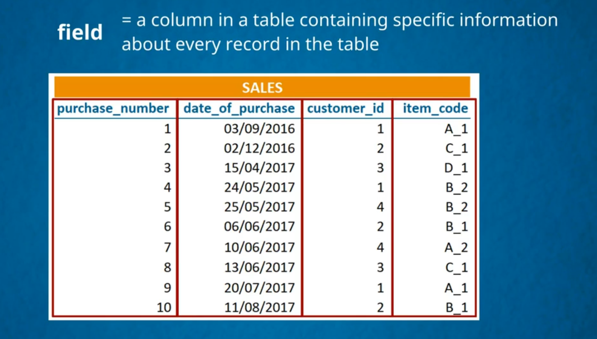

<!-- image -->

> # what is MySql 

---

> # what is querying 

---

> # DataBase and SQL Theory

1. ### Each value is called data value
1. ### All for data values create a one record as in one row

---

> # what is a field
>
> 

---

> # what is an Realational algebra

---

> # what is an entity

---