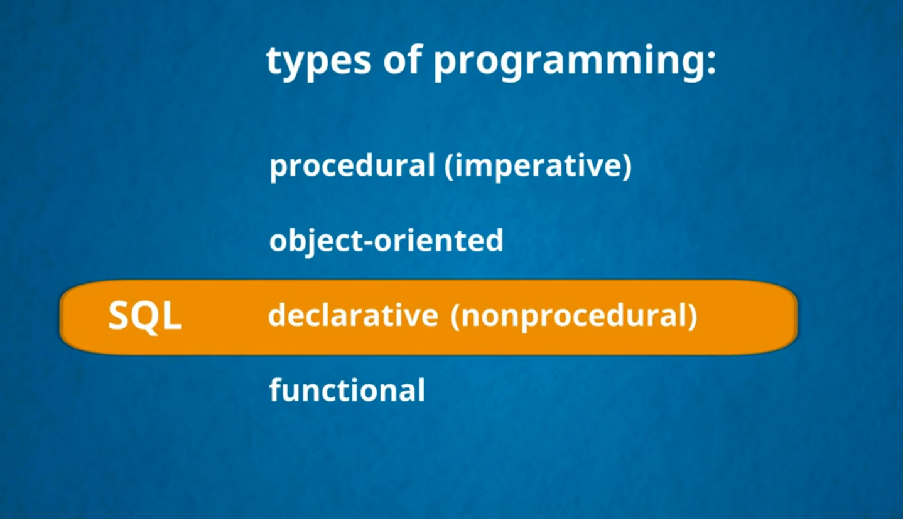
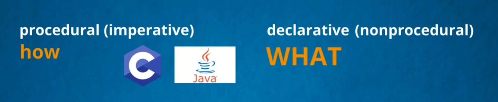
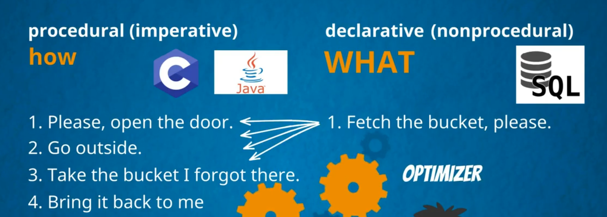
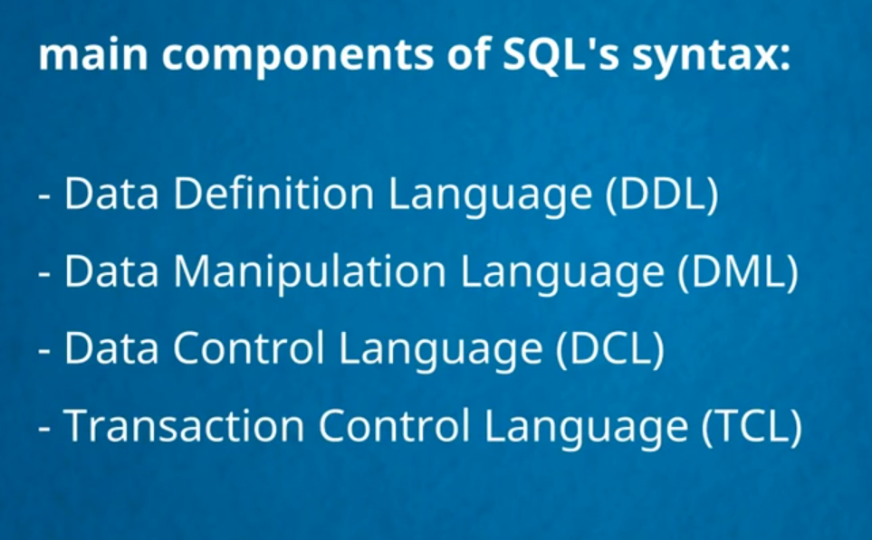

>## what kind of programming language is mysql

___
___
>## Main Component Of SQL

* [Data definition language (DDL)](pdf/1.pdf)
    * [Key Words](pdf/2.pdf)
* [Data manipulation language (DML)](pdf/3.pdf)
* [Data control language (DCL)](pdf/4.pdf)
* [ Transaction control language (TCL)](pdf/5.pdf)

