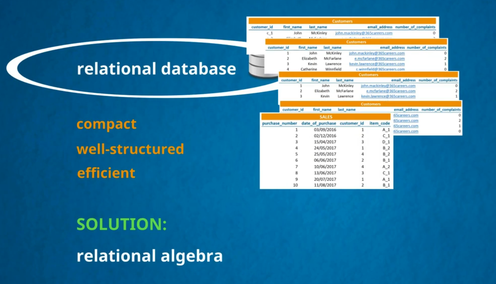

> # Relational DataBase Essentials

- ## Data Base Types
  

---

- ## Main Goal
  

---

- ## Realational Algebra
  

---

- ## If We Use One Table
  

---

- ## What If We Use Three Table With Following Realtionship
  

---

- ## Realationships
  

---
- ## RDMS
  

---
