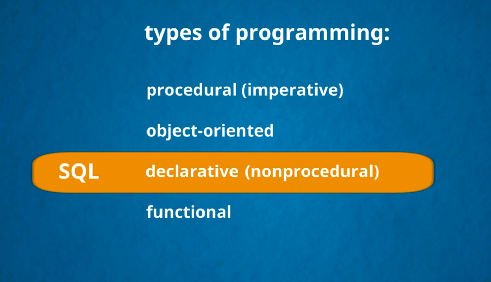
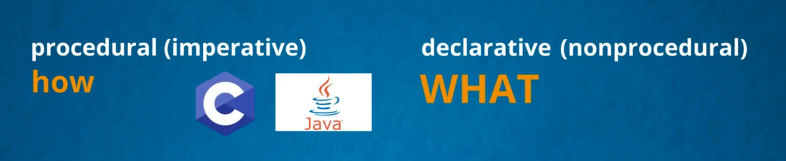
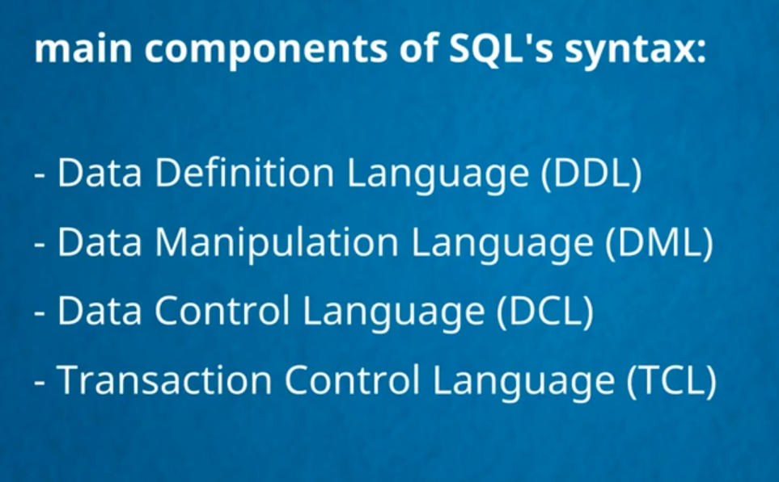

>## what kind of programming language is mysql

___
___
>## Main Component Of SQL

* [Data definition language (DDL)](1.pdf)
* [Data manipulation language (DML)](3.pdf)
* [Data control language (DCL)](4.pdf)
* [ Transaction control language (TCL)](4.pdf)